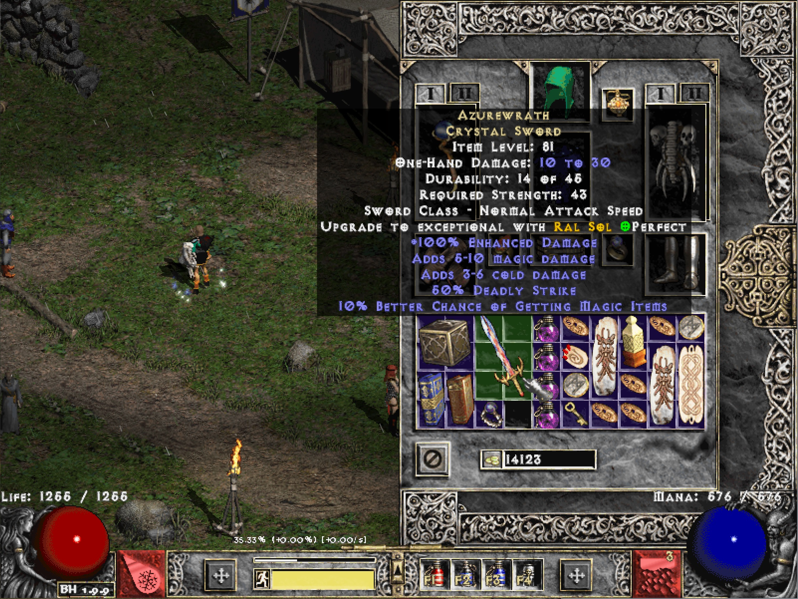

## Mod Maker MPQ
A tool to create modded MPQ files with commonly changed settings all in one place.
Works for LoD and it's Mods.

### Install WinMPQ libs
Mod maker uses WinMPQ from https://sfsrealm.hopto.org/downloads/WinMPQ.html to automatically add `.bin` files to an `.mpq` file.

First install `Vbr4` from `py_converter/WinMPQ/Vbr4` by double clicking setup.exe.

Then install `RunPack3` from `py_converter/WinMPQ/RunPack3` by double clicking setup.exe.


### Usage
Copy and paste your current `patch_d2.mpq` from `../Diablo II/` to `.../mod_maker/mpqOrig/` (create the `mpqOrig` folder if it doesn't exist).

This will be the mpq file that `mod maker mpq` will add your modified `.bin` files to.
The output, modified mpq will be in `mpqModded/patch_d2.mpq`.

Edit the sections in `settings.ini` and create `.bin` files that are added to `patch_d2.mp` with:
```cmd
python make_mod_mpq.py
```

To have `mod maker mpq` ignore any settings comment the lines out with `;`s (semicolons).


### Example
Edit `Monster Density` for the Secret Cow Level/Moo Moo Farm in section `[Monster Density]`

```ini
[Monster Density]

; default=800
Moo Moo Farm=4000
```


### Add patch_d2.mpq to Diablo II
Once `mod maker mpq` adds the modded `.bin` files to `mpqModded/patch_d2.mpq` copy and paste the modded mpq to your Diablo II folder (usually `.../Program Files (x86)/Diablo II/`).


### Screenshots
- Azurewrath crystal sword enabled


- Constricting ring enabled


- Monster density in the cow level


### Inspired by
https://github.com/tlentz/d2modmaker

where a config is kept in `cfg.json` and can be changed to produce a new data folder (and modded files are added to `.../Diablo II/data/global/excel`).
