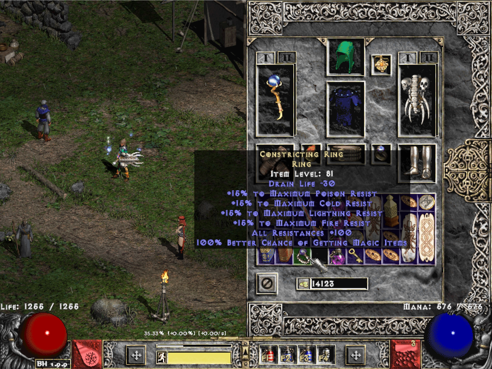

## Mod Maker MPQ
A tool to create modded MPQ files with commonly changed settings all in one place.
Works for LoD and it's Mods.

### (Step 0 prep) Install WinMPQ libs 
Mod maker MPQ uses WinMPQ from https://sfsrealm.hopto.org/downloads/WinMPQ.html to automatically add `.bin` files to an `.mpq` file.

[Download](https://github.com/pairofdocs/mod_maker_mpq/archive/refs/heads/master.zip) the files from this github page and unzip to a location on your PC.

First install `Vbr4` from `mod_maker_mpq/WinMPQ/Vbr4` by double clicking setup.exe.

Then install `RunPack3` from `mod_maker_mpq/WinMPQ/RunPack3` by double clicking setup.exe.
These libs need to be installed only once.


### Usage
If not done already, [download](https://github.com/pairofdocs/mod_maker_mpq/archive/refs/heads/master.zip) the files from this github page and unzip to a location on your PC.

Copy and paste your current `patch_d2.mpq` from `<yourpath>.../Diablo II/` to `mod_maker_mpq/mpqOrig/`.

`mod maker mpq` will use the original mpq file and based on configured settings will create a modified one in `mod_maker_mpq/mpqModded/`.

Edit the sections in `settings.ini` ([settings](https://github.com/pairofdocs/mod_maker_mpq/blob/master/settings.ini)) and create a modded `patch_d2.mp` with:
```cmd
python make_mod_mpq.py
```

To have `mod maker mpq` ignore any settings comment the lines out with `;`s (semicolons).
But leave the "sections", lines starting with `[`, as they are.


### Example
Edit `Monster Density` for the Secret Cow Level/Moo Moo Farm in section `[Monster Density]`

```ini
[Monster Density]

; default=800
Moo Moo Farm=4000
```

To add a level that is not present in the default settings, add the exact level name to the ini and specify a density value.
A reference for LoD level names is [here](https://github.com/fabd/diablo2/blob/master/code/d2_113_data/Levels.txt) under the column `LevelName`.

Add the Stony Tombs with:

```ini
; default 2200
Stony Tomb Level 1=3000

Stony Tomb Level 2=3000
```


### Add patch_d2.mpq to Diablo II
Once `mod maker mpq` does it's processing and adds modded `.bin` files to `mod_maker_mpq/mpqModded/patch_d2.mpq` copy and paste the modded mpq to your Diablo II folder (usually `.../Program Files (x86)/Diablo II/`).


### Screenshots and Features
- Azurewrath crystal sword enabled


- Constricting ring enabled


- Monster density in the cow level

- Cooldown reduced for Meteor

- Cooldown reduced for Frozen Orb


### Credits
Credit goes to [D2Mods.info](https://d2mods.info/home.php) for many useful resources,

https://github.com/CaiMiao/d2bin2txt for data structures of Diablo 2 files,

https://github.com/fabd/diablo2/tree/master/code/d2_113_data for Diablo 2 data txt files.

Thank you collaborators @Duits, @ogjex


### Inspired by
https://github.com/tlentz/d2modmaker

where a config is kept in `cfg.json` and can be changed to produce a new data folder (and modded files are added to `.../Diablo II/data/global/excel`).
